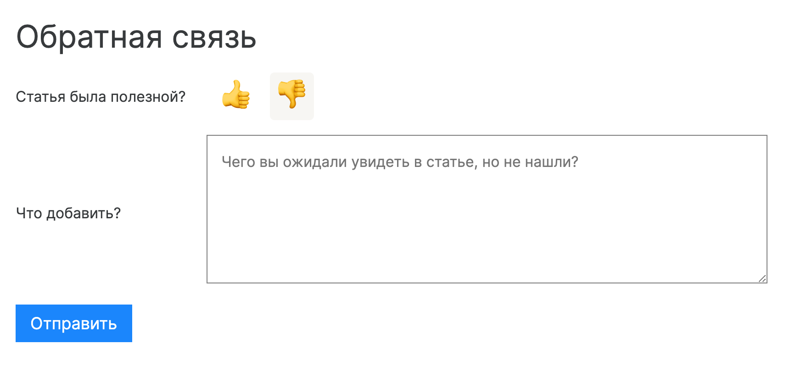

# Дока (beta)

Дока — это место, в котором мы с огоньком перекапываем документацию по веб-разработке. Наша цель сделать ее практичной, понятной и не унылой.

Доку [можно посмотреть тут](https://y-doka.site/). Да, наш маскот — это енотособака.

Пока что в Доке есть три раздела: [HTML](https://y-doka.site/html/), [CSS](https://y-doka.site/css/) и [JavaScript + Инфраструктура](https://y-doka.site/js/). Все материалы делятся на статьи и лонгриды. В первых можно найти быстрое руководство к действию, во вторых — занырнуть в целую область разработки и понять ее заново.

## Как поучаствовать

[Руководство контрибьютора](./CONTRIBUTING.md)

В доке выше мы расписали всё очень подробно, но вот короткая выжимка:

- Предлагайте правки для статей через пул-реквесты, мы будем своевременно ревьюить их и раздавать бейджи самым активным контрибьюторам.
- Загляните в [раздел Issues](https://github.com/Y-Doka/y-doka.site/issues) репозитория, чтобы ознакомиться со списком актуальных задач. Там есть, как задачи для новичков, так и реальные фичи для сайта, которые мы можем делать сообща.
- Если вы уже читаете Доку, ставьте лайки и дизы — оставляйте подробные комментарии через форму обратной связи после каждой статьи. Команда авторов будет регулярно их просматривать и брать в работу.

  

- Пишите статьи и предлагайте новые темы. Ждем ваших идей и обещаем познакомить вас с командой Доки. Мы всегда открыты новым авторам.

[Руководство для авторов](./WRITING.md)

## Немного занудства

Мы тестируем Доку в режиме закрытой беты, поэтому призываем вас не делиться этими материалами публично и оставлять фидбек через сайт.

Давайте соберем команду единомышленников, допилим контент и продукт, и запустимся публично — уже в следующем году **🙌**
